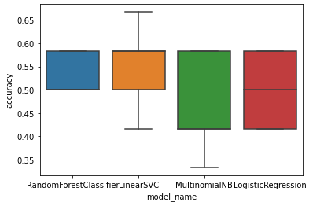

# Cooky
Cooky is an API that allows users to quickly and automatically classify their recipes' difficulties. This is aimed at independent chefs who publish their recipes online and would like to add a difficulty filter to allow their users to access recipes accessible to their skill levels. Cooky is a multi-class text classification model that searches through instructions in a recipe for features specifically relating to difficulty levels ranging from 'Easy' to 'Challenging'. 

# Why AI?
If you have a team of skilled chefs and editors the way that food magazines do then determining the difficulty of a recipe may be easy as the difficulty level can be crowdsourced within the team. However, if you're an independent online chef and editor then picking the difficulty of a recipe can feel random and you cannot really be sure if your readers, who may be amateurs, will agree. By implementing an AI trained with data obtained from various recipes from https://www.greatbritishchefs.com/, your recipe will be categorised as if you had a whole editorial team behind you except it will be much faster. 

# Project Details

## Scope
The scope was limited such that the model is only equipped to classify savoury European cuisines. 

## Approach
### The data phase
The inital data processing and model selection was done in a python notebook using the Azure Machine Learning Studio Notebooks.

1. 60 recipes from https://www.greatbritishchefs.com/ were chosen such that there was an even amount of recipes that were 'Easy', 'Medium' and 'Challenging' and such that there were an even number of recipes using poultry, beef, pork, lamb, seafood, and were vegetarian. 
2. The instructions from these recipes as well as their difficulty levels were extracted using the BeautifulSoup and requests python libraries. 
```python
from bs4 import BeautifulSoup
import requests
import pandas as pd

def url_to_recipe(url):
  # this function takes a recipe url from https://www.greatbritishchefs.com/ and extracts the recipe title, method, and difficulty level using BeautifulSoup.
  recipe = requests.get(url).text
  soup = BeautifulSoup(recipe, 'lxml')
  
  # extracting the recipe name
  recipe_name = soup.find(class_="Recipe__Header Header").find("h1").text
  # extracting the recipe difficulty
  difficulty = soup.find(class_="RecipeAttributes__Difficulty")

  if difficulty.find(class_="header-attribute-text text-capitalize medium"):
    recipe_difficulty= difficulty.find(class_="header-attribute-text text-capitalize medium").text
  else: 
    recipe_difficulty = difficulty.find(class_="header-attribute-text text-capitalize").text
  
  # extracting the recipe method
  recipe_method = [p.text for p in soup.find(class_="Recipe__Method Method").find_all(class_="MethodList__StepText")]

  return [recipe_name, recipe_difficulty, recipe_method]
  
# recipe_urls was a list containing 60 recipe urls from https://www.greatbritishchefs.com/. Each url from this list was fed to the url_to_recipe() function and recipe 
# information was extracted
recipes = [url_to_recipe(url) for url in recipe_urls]
```
3. The text data underwent a preliminary cleaning and was combined into a corpus for use as a dataset in the Machine Learning Designer. 
```python
def combine_text(list_of_text):
  # Takes a list of text and combines them into one large group of text.
  combined_text = ' '.join(list_of_text)
  return combined_text
  
recipe_names = [r[0] for r in recipes]
recipe_difficulties = [r[1] for r in recipes]
recipe_combined = [combine_text(r[2]) for r in recipes]
recipe_methods = [r.replace("\r\n", " ") for r in recipe_combined]
recipe_names = [r.replace("\r\n", " ") for r in recipe_names]

pd.set_option('max_colwidth', 200)
# organising data into corpus 
data = {"Recipe Name": recipe_names, "Method": recipe_methods, "Difficulty": recipe_difficulties}
recipe_df = pd.DataFrame(data=data, columns=["Recipe_Name", "Method", "Difficulty"])

# storing in a csv file for later use in Azure Machine Learning Designer.
recipe_df.to_csv("recipe_corpus.csv")
```
4. Features were extracted from the cleaned data and along with labels (the difficulty levels) were used to train multiple multi-class classification models available in the scikit-learn library. The models used were Logistic Regression, Multinomial NB, Random Forest Classifier, and Linear SVC. The models were compared by their accuracy and the best model (Random Forest) was selected.
```python
from sklearn.model_selection import train_test_split
from sklearn.feature_extraction.text import CountVectorizer, TfidfTransformer, TfidfVectorizer

# TfidfVectorizer works very similarly to the 'Extract N-Gram Features from Text' module in the Machine Learning Designer while also further cleaning text data.
# It extracts features from the text - in this case it's extract unigrams and bigrams 'ngram_range=(1,2)'. I chose this range because...
# I set the min_df (minimum document frequency) to 10 after performing trial and error with this filter and finding that 10 increased the accuracy of the models 
# without being too limiting. 
tfidf = TfidfVectorizer(sublinear_tf=True, min_df = 10, norm='l2', encoding='latin-1', ngram_range=(1,2), stop_words='english')

# features is a document term matrix that contains information about how frequently specific features(ngrams) appear across recipes of the same difficulty classification.
features = tfidf.fit_transform(recipe_df.Method).toarray()
labels = recipe_df.Difficulty

# split the training and testing data. train_size was determined based on trial and error. First I started with the default value of 0.75 and tried lowering it
# incrementally and increasing it and I found 0.78 to yield the highest accuracy. train_size of 0.8 or above resulted in lower accuracy. 
x_train, x_test, y_train, y_test = train_test_split(features, labels, train_size=0.78, random_state=1)

import sklearn
from sklearn.linear_model import LogisticRegression
from sklearn.ensemble import RandomForestClassifier
from sklearn.svm import LinearSVC
from sklearn.naive_bayes import MultinomialNB
from sklearn.model_selection import cross_val_score

from sklearn.metrics import confusion_matrix
import matplotlib.pyplot as plt
import seaborn as sns

models = [RandomForestClassifier(n_estimators=50, max_depth=5, random_state=1),
          LinearSVC(),
          MultinomialNB(),
          LogisticRegression(random_state=1)]
          
CV = 5
cv_df = pd.DataFrame(index=range(CV*len(models)))
entries = []

for model in models:
  model_name = model.__class__.__name__
  accuracies = cross_val_score(model, features, labels, scoring='accuracy', cv=CV)
  for fold_idx, accuracy in enumerate(accuracies):
    entries.append((model_name, fold_idx, accuracy))

cv_df = pd.DataFrame(entries, columns=['model_name', 'fold_idx', 'accuracy'])

sns.boxplot(x='model_name', y='accuracy', data=cv_df)
plt.show()
```

6. A training pipeline was created using Microsoft Azure Machine Learning Designer. The model was scored and evaluated before an inference pipeline was created. 
7. The model was deployed. 

# Implementation


# Requesting the Model
You can access the deployed model through these steps:
```python
import urllib.request
import json
import os

url = 'http://9c38f2e2-32a8-4957-a52b-bb8f13252dd0.australiaeast.azurecontainer.io/score' #the model endpoint
key = 'DmJUk8IK9nvVQwG6HMC8YkaaYhrHPQGZ' #the primary key

data = {
    "Inputs": {
        "WebServiceInput0":
        [
            {
                'Unnamed: 0': "0",
                'Method': "Insert recipe method text here", #insert your recipe method text
            },
        ],
    },
    "GlobalParameters": {
    }
}

body = str.encode(json.dumps(data))

headers = {'Content-Type':'application/json', 'Authorization':('Bearer '+ key)}

req = urllib.request.Request(url, body, headers)

try:
    response = urllib.request.urlopen(req)
    result = response.read()
    json_result = json.loads(result)
    recipe_difficulty = json_result["Results"]["WebServiceOutput0"][0]["RecipeDifficulty"] # this can be input into your recipe database along with the recipe it classified
except urllib.error.HTTPError as error:
    print("The request failed with status code: " + str(error.code))

    # Print the headers to help debug
    print(error.info())
    print(json.loads(error.read().decode("utf8", 'ignore')))

```

